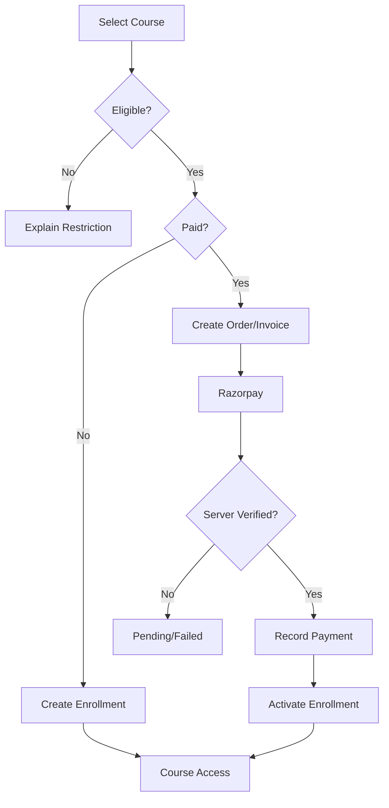
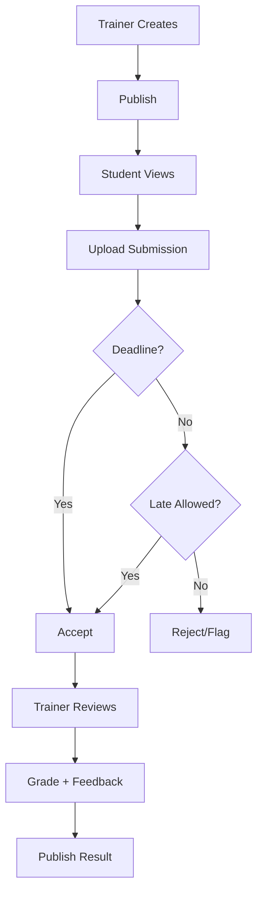
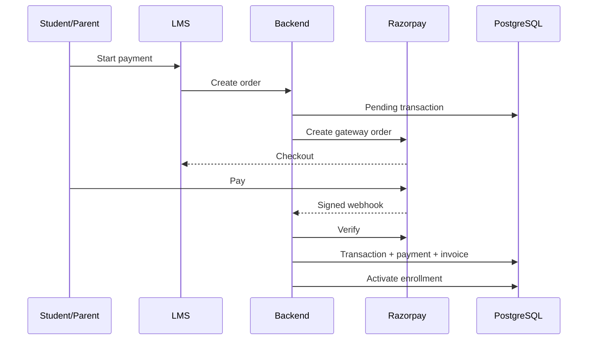
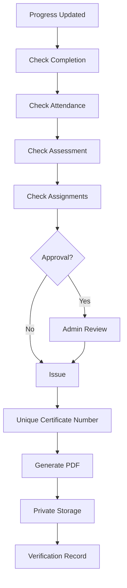
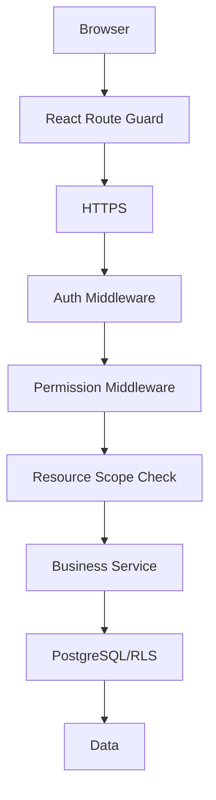
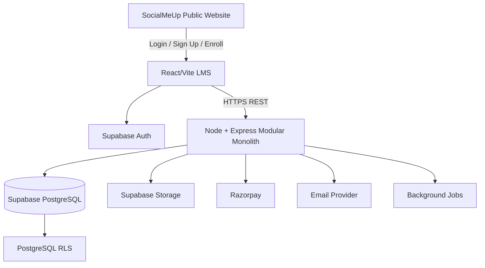
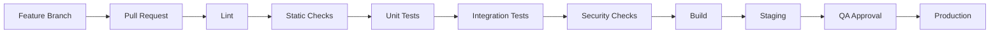

# SocialMeUp Academy LMS — Production-Ready Software Product Requirements Document

**Version:** 1.0  
**Status:** Implementation Baseline  
**Product:** SocialMeUp Academy LMS  
**Public Website:** https://socialmeupacademy.in/  
**Recommended LMS:** `lms.socialmeupacademy.in`  
**Primary brand:** `#007991`  
**Primary CTA:** `#FF9635`  
**Typography:** Inter / system sans-serif

> This PRD is the implementation specification for SocialMeUp Academy's authenticated learning ecosystem. It is not a generic LMS. Confirmed product requirements come from the supplied LMS/use-case specification and previously supplied architecture/database specifications. Architectural choices marked **Recommendation** are production-grade decisions made where requirements were not explicit.

---

## 1. Executive Summary

SocialMeUp Academy LMS centralizes the complete learner lifecycle:

**Website visitor → registration/login → authentication → role authorization → dashboard → enrollment → learning → attendance → assignments → assessments → progress → payments → communication → certification → career support/reporting.**

The existing academy website presents SocialMeUp as a digital-marketing academy + agency focused on practical training, AI-integrated digital marketing, live projects, online/offline learning, certificates and career/placement assistance. Its current public information includes flagship programs, micro courses, placement support, free-demo/enrollment CTAs and learning resources. The LMS therefore becomes the authenticated operational layer behind those public promises rather than a disconnected education product.

**Final architecture recommendation:** React + Vite LMS frontend, Node.js + Express secure modular monolith, Supabase PostgreSQL/Auth/Storage/RLS, Razorpay, REST APIs, Vercel frontend, Railway backend, and `lms.socialmeupacademy.in`.

---

## 2. Product Vision

Create a secure, scalable and premium academy operating system that manages students, parents/guardians, trainers, administrators, courses, batches, learning, attendance, assessments, finance, certification, communication, grievances and future career-support workflows.

The product must feel like:

> **SocialMeUp Academy Website + SocialMeUp Academy LMS**

not two unrelated products.

### Product principles

1. Security before convenience.
2. Database integrity before frontend assumptions.
3. Role scope must be enforced server-side and at database/RLS level.
4. Preserve SocialMeUp branding.
5. Modular monolith first; distributed architecture only when justified.
6. Keep financial and audit history durable.
7. Design APIs so future mobile applications can reuse them.
8. AI must inherit existing authorization boundaries.

---

## 3. Problem Statement

The academy needs one source of truth after a visitor becomes a learner. Without a centralized LMS, course content, attendance, assignments, grades, payments, certificates, communication and support can become fragmented across spreadsheets, messaging applications, payment systems and file stores.

The LMS solves this by creating one controlled system of record for the entire student lifecycle.

---

## 4. Business Goals

| Goal | Outcome |
|---|---|
| Centralize lifecycle | One authoritative learner record |
| Improve learning | Structured courses, progress and deadlines |
| Improve operations | Batches, attendance, grading and reports |
| Improve parent visibility | Secure linked-student monitoring |
| Improve trainer productivity | Scoped teaching/attendance/grading tools |
| Improve finance | Server-verified payments and invoices |
| Automate certification | Configurable eligibility and verification |
| Improve communication | Messages, announcements and notifications |
| Preserve brand | LMS visually extends existing academy |
| Future-proof | Mobile, AI, live classes and career ecosystem ready |

**MVP non-goals:** full multi-tenancy, microservices, data warehouse, native mobile apps, advanced recommendation engine and unrestricted AI tutor.

---

## 5. Existing Website Integration

The current public site contains Home, About Us, All Courses/Main Programs, Micro Courses, Courses/Programs, Placements, Resources, Blog, Free Guides, Case Studies and Contact journeys. The homepage promotes practical experience, expert-led education, online/offline learning, professional certification, AI/digital-marketing skills and career/placement support. The courses pages list flagship programs and micro courses with pricing, durations and practical features.

### Required integration

```text
socialmeupacademy.in
       |
       | Login / Sign Up / Enroll Now / Student Portal
       v
lms.socialmeupacademy.in
       |
       v
Authentication
       |
       v
Role Detection
       |
       +--> Student Dashboard
       +--> Parent Dashboard
       +--> Trainer Dashboard
       +--> Admin Dashboard
```

Course CTAs should pass course context where useful, e.g. `register?course=<slug>`, but the backend must validate the course and eligibility independently.

---

## 6. Target Users & Personas

### Student
Needs learning, progress, attendance, assignments, assessments, grades, payments, communication, certificate and career support.

### Parent/Guardian
Needs monitoring of explicitly linked students, attendance, grades, progress, assignments, fees, payments, alerts and communication.

### Trainer/Instructor
Needs assigned courses/batches, classes, attendance, assignments, grading, feedback, announcements and student-performance visibility.

### Admin
Needs complete operational control: users, roles, courses, batches, trainers, students, enrollment, finance, certificates, grievances, reports, configuration and audit.

---

## 7. Roles & RBAC

Primary roles:

- `student`
- `parent`
- `trainer`
- `admin`

Support future multi-role users through normalized `user_roles`.

### Permission examples

`users.read`, `users.create`, `users.update`, `users.delete`  
`courses.read`, `courses.create`, `courses.update`, `courses.delete`  
`enrollments.read`, `enrollments.create`, `enrollments.update`  
`assignments.create`, `assignments.submit`, `assignments.grade`  
`attendance.view`, `attendance.mark`, `attendance.manage`  
`payments.view`, `payments.create`, `payments.manage`  
`certificates.view`, `certificates.issue`, `certificates.manage`  
`reports.view`, `reports.generate`  
`messages.send`, `messages.read`  
`grievances.create`, `grievances.manage`

### Authorization layers

1. React route guard — UX.
2. Backend authentication middleware — identity.
3. Backend permission/resource-scope checks — business authorization.
4. Supabase RLS — defense-in-depth data boundary.

A URL/body/ID modification must never bypass these layers.

---

## 8. Authentication & Account Lifecycle

### Registration

Common fields:

- Name
- Email
- Phone
- Password
- Confirm password
- Terms acceptance

Role-specific onboarding follows common registration.

**Recommendation:** public users cannot self-register as admin. Trainer/admin accounts are invitation/provisioning workflows.

### Login flow

```mermaid
flowchart TD
 A[Login] --> B[Supabase Auth]
 B --> C{Valid?}
 C -- No --> D[Authentication Error]
 C -- Yes --> E[Load Profile]
 E --> F[Load Roles]
 F --> G[Check Account Status]
 G --> H{Active?}
 H -- No --> I[Pending/Suspended/Deactivated]
 H -- Yes --> J[Role Detection]
 J --> K[Student]
 J --> L[Parent]
 J --> M[Trainer]
 J --> N[Admin]
 K --> O[/student/dashboard]
 L --> P[/parent/dashboard]
 M --> Q[/trainer/dashboard]
 N --> R[/admin/dashboard]
```

Account states: `active`, `pending`, `suspended`, `deactivated`, `archived`.

Required: email verification, forgot password, reset password, logout and secure session handling. Future: Google login and phone OTP.

---

## 9. Student Requirements

### Features

- Register/login
- Profile/password management
- Browse courses
- Enroll
- Learn course content
- Continue from last lesson
- Track course/module/lesson progress
- View attendance
- Submit assignments
- Take quizzes/exams
- View published grades/feedback
- Message trainers
- Discussions/forums where enabled
- Raise grievance
- View activity summary/chatbot
- View payments and invoices
- Download certificates

### Dashboard

Welcome, enrolled courses, continue learning, progress, upcoming classes, assignments, assessments, attendance, recent grades, payment status, certificates, announcements, notifications and messages.

---

## 10. Parent/Guardian Requirements

Parent access is relationship-based, never ID-based.

Features:

- View linked student(s)
- Attendance
- Progress
- Upcoming assignments
- Grades/reports
- Outstanding fees
- Online payments
- Receipts
- Teacher communication
- Automated alerts
- Announcements
- Grievances
- Activity summary/chatbot

`parent_student_links` is the authoritative access relationship. Permissions may differ per linked student.

---

## 11. Trainer Requirements

- Assigned courses
- Assigned batches
- Today's/upcoming classes
- Student lists
- Student progress
- Attendance marking
- Course/content management within scope
- Assignment creation
- Submission review
- Grading and feedback
- Resubmission requests
- Announcements
- Messaging
- Performance summary
- Grievance/support access

Trainers must only access students/courses/batches they are authorized to manage.

---

## 12. Admin Requirements

### User management
Create/manage users, roles, permissions, suspend/deactivate, bulk operations and controlled credential workflows.

### Academic management
Courses, modules, lessons, resources, batches, trainers, schedules, enrollment and visibility.

### Finance
Fee structures, fees, invoices, payment history, reminders, refunds and reconciliation.

### Certification
Templates, eligibility rules, issuance, verification and revocation.

### Operations
Attendance, grievances, reports, system configuration, audit logs and system health.

---

## 13. Course Architecture

```text
Course
 ├── Modules
 │    ├── Lessons
 │    │    ├── Content
 │    │    └── Resources
 │    ├── Assignments
 │    └── Assessments
 ├── Batches
 ├── Trainers
 ├── Completion Rules
 └── Certificate Rules
```

Course fields:

- title, slug, short_description, description
- thumbnail
- duration
- price, discount
- course_type
- skill_level
- category
- delivery_mode
- start/end dates
- status
- visibility
- completion requirements
- certificate eligibility

Statuses: Draft, Published, Unpublished, Archived.

Content types: video, text, PDF, external resource, downloadable file and embedded content.

Learning events: lesson started, lesson completed, video progress, last position, module progress, course progress, completion date.

---

## 14. Enrollment

Supported modes:

- Paid
- Free
- Admin enrollment
- Bulk enrollment
- Manual enrollment
- Batch enrollment
- Approval workflow

Statuses: Pending, Active, Completed, Cancelled, Suspended, Expired.

### Flow



Duplicate active enrollment must be prevented using transaction + unique/partial unique constraint.

---

## 15. Attendance

Attendance dimensions:

- Course
- Batch
- Session
- Student
- Trainer
- Date/time
- Status
- Remarks

Statuses: Present, Absent, Late, Excused.

Rules:

- Trainer can mark only assigned sessions.
- Student cannot edit attendance.
- Parent can only view linked student attendance.
- Admin has full controlled access.
- Corrections are auditable.
- Duplicate session/student attendance is prevented.

---

## 16. Assignments

Fields:

- title
- description
- instructions
- course/module/lesson
- attachments
- deadline
- maximum marks
- submission type
- rubric
- late/resubmission policy

### Flow



Students can edit before deadline where enabled. Trainers can grade authorized submissions. Results are visible only when published.

---

## 17. Assessments

Types: MCQ, multiple-select, true/false, short answer, descriptive.

Features:

- Timer
- Attempts
- Randomization
- Marks
- Passing score
- Auto-grading
- Manual grading
- Feedback
- Result publication

Server must own attempt state and timeout rules. Correct answers are never exposed before allowed.

---

## 18. Progress Tracking

Track:

- Course completion percentage
- Module completion
- Lesson completion
- Assignment completion
- Assessment scores
- Attendance
- Overall performance
- Learning streak where appropriate

Progress views are role-scoped for student, parent, trainer and admin.

---

## 19. Payments & Finance

Support:

- Course pricing
- Fees
- Discounts
- Installments
- Payment status/history
- Invoices
- Receipts
- Reminders
- Failed payments
- Refund status

Statuses: Pending, Processing, Paid, Failed, Refunded, Partially Refunded.

### Payment security

Frontend payment status is never authoritative. Backend creates the order, verifies signatures/webhooks, records transactions and activates enrollment only after verification.



Provider event IDs must be unique/idempotent.

---

## 20. Certification

Eligibility can depend on:

- Course completion
- Minimum attendance
- Assessment score
- Assignment completion
- Admin approval

Certificate includes student, course, completion/issue dates, unique certificate ID, academy branding, signature and verification URL/QR.

### Flow



Verification route should expose only safe public verification information. Revocation is auditable.

---

## 21. Communication & Notifications

### Communication

- Internal messages
- Trainer/student messages
- Parent/trainer messages
- Announcements
- System alerts

### Notification types

Assignment due, graded, announcement, payment reminder/confirmation, enrollment, attendance alert, certificate issued, grievance update and security events.

Future adapters: Email, WhatsApp, SMS, push.

Recommendation: use a notification-service interface so channels are replaceable.

---

## 22. Grievance/Support

Fields:

- ticket ID/number
- user
- category
- subject
- description
- priority
- status
- assigned staff
- attachments
- comments
- created/resolved dates

Statuses: Open, In Progress, Waiting, Resolved, Closed.

Users can create/view own tickets; authorized staff/admins manage assigned scope.

---

## 23. AI Chatbot / Activity Summary

Future architecture:

```text
Authenticated User
      ↓
AI Gateway
      ↓
Role + Permission Context
      ↓
Authorized Data Retrieval
      ↓
LLM
      ↓
Response
```

Student: course navigation, reminders, progress, FAQs.  
Parent: linked-student summaries.  
Admin: activity/report insights.

**Non-negotiable:** AI must never retrieve data outside the authenticated user's permitted scope.

---

## 24. Dashboard UX

### Student
Learning-first: continue course, progress, upcoming activities, attendance, assignments, grades, payments, certificate and communication.

### Parent
Monitoring-first: student switcher, attendance, progress, grades, assignments, fees, payment history, alerts and communication.

### Trainer
Teaching-first: assigned courses/batches, classes, attendance, submissions, grading, student performance and messages.

### Admin
Operations-first: students, trainers, courses, enrollments, revenue, attendance, certificates, grievances, reports and system health.

---

## 25. UI/UX Design System

The LMS must match SocialMeUp Academy's existing identity.

```css
--color-primary: #007991;
--color-cta: #FF9635;
--color-bg: #FFFFFF;
--color-surface: #F7F9FA;
--color-text: #1F2933;
--color-text-secondary: #667085;
--color-border: #E5E7EB;
```

Supporting neutrals are subordinate to the brand. Do not introduce unrelated purple, neon green or arbitrary accent systems.

Typography: Inter, system-ui, -apple-system, BlinkMacSystemFont, "Segoe UI", sans-serif.

Use responsive `clamp()` typography, generous whitespace, rounded cards where appropriate, subtle shadows and strong hierarchy.

Reusable components:

Navbar, Sidebar, MobileNav, Breadcrumb, Button, Input, Select, Search, Filter, Modal, Drawer, Tabs, Card, Table, Pagination, Badge, Progress, Charts, Dropdown, Toast, ConfirmationDialog, EmptyState, Loading, Skeleton, ErrorState, FileUpload, VideoPlayer, CoursePlayer and QuizInterface.

---

## 26. Responsive & Accessibility Requirements

Breakpoints: mobile, tablet, laptop, desktop, large desktop.

Requirements:

- collapsible sidebar
- touch-friendly controls
- responsive tables
- mobile video/file upload
- responsive charts
- no page overflow
- semantic HTML
- keyboard navigation
- visible focus
- labels and accessible validation
- sufficient contrast
- ARIA only when required
- screen-reader support
- reduced-motion support

Target WCAG 2.2 AA principles.

---

## 27. Database Architecture

**Decision: PostgreSQL, preferably Supabase PostgreSQL.**

Reason: the LMS has dense relationships, transactions, financial records, reporting, foreign-key integrity and RLS requirements. MongoDB can model these relationships but PostgreSQL provides a stronger default for this workload.

### Identity architecture

```text
Supabase Auth
    ↓
auth.users
    ↓ 1:1
profiles
    ├── student_profiles
    ├── parent_profiles
    ├── trainer_profiles
    └── admin_profiles
    ↓
roles / permissions / user_roles
    ↓
PostgreSQL domain model
    ↓
RLS
    ↓
Storage references
```

Do not duplicate passwords. `profiles.id` should reference `auth.users.id`.

### Database principles

- Approximately 3NF
- UUID primary keys
- TIMESTAMPTZ
- Foreign keys
- Unique constraints
- Database constraints over frontend assumptions
- Avoid excessive JSONB
- Avoid storing binaries in PostgreSQL
- Do not blindly cascade deletes
- RLS as security boundary
- Version-controlled migrations

---

## 28. Required Entities

`profiles`, `roles`, `permissions`, `role_permissions`, `user_roles`, `students`, `parents`, `parent_student_links`, `trainers`, `courses`, `course_modules`, `lessons`, `lesson_resources`, `batches`, `batch_students`, `batch_trainers`, `enrollments`, `course_progress`, `lesson_progress`, `attendance`, `assignments`, `assignment_submissions`, `assessments`, `assessment_questions`, `assessment_options`, `assessment_attempts`, `assessment_answers`, `grades`, `fee_structures`, `fees`, `invoices`, `payments`, `payment_transactions`, `certificates`, `certificate_templates`, `messages`, `announcements`, `notifications`, `grievance_tickets`, `grievance_comments`, `activity_logs`, `system_settings`.

### Common audit fields

```text
id UUID
created_at TIMESTAMPTZ
updated_at TIMESTAMPTZ
created_by UUID
updated_by UUID
deleted_at TIMESTAMPTZ
status TEXT
```

Use only where semantically appropriate.

---

## 29. Core Schema

### `profiles`

`id UUID PK -> auth.users.id`, `full_name`, `email`, `phone`, `avatar_path`, `account_status`, `last_login_at`, timestamps.

### `roles`

`id`, `code UNIQUE`, `name`, `description`, `status`.

### `permissions`

`id`, `code UNIQUE`, `name`, `description`.

### `parent_student_links`

`id`, `parent_id FK`, `student_id FK`, `relationship`, per-student permission flags, `status`, timestamps.

`UNIQUE(parent_id, student_id)`.

### `courses`

`id`, `title`, `slug UNIQUE`, descriptions, thumbnail, duration, price, discount, type, level, category, delivery mode, dates, status, visibility, certificate eligibility, audit fields.

### `course_modules`

`id`, `course_id FK`, title, description, `sort_order`, status.  
`UNIQUE(course_id, sort_order)`.

### `lessons`

`id`, `module_id FK`, title, description, content type/body, video URL, duration, sort order, preview flag, status.

### `enrollments`

`id`, `student_id FK`, `course_id FK`, `batch_id FK NULL`, status, enrolled/started/completed/expiry dates, source, approved_by.

### `course_progress`

One row per enrollment: percentage, lesson counts, last lesson, last accessed, completion.

### `lesson_progress`

`UNIQUE(enrollment_id, lesson_id)`, start/completion, percentage, last position.

### `attendance`

Session, student, trainer, status, timestamp, remarks, marker.  
`UNIQUE(session_id, student_id)`.

### `assignments`

Course/module/lesson, title, instructions, due date, max marks, submission type, rubric, late/resubmission rules.

### `assignment_submissions`

Assignment, student, attempt number, submitted time, late flag, status, grade, feedback, grader.  
`UNIQUE(assignment_id, student_id, attempt_number)`.

### `assessments`

Course/module, title, duration, max attempts, passing score, randomization, publication state.

### `assessment_questions/options/attempts/answers`

Normalized question, option, attempt and answer records. Correct-answer data remains server-side.

### Finance

`fee_structures` define rules; `fees` represent student obligations; `invoices` represent billable documents; `payments` represent verified money; `payment_transactions` represent gateway events.

### `certificates`

Student/course/enrollment, unique certificate number, dates, verification token, file path, status, revocation information.

### Communication/support

Messages, announcements, notifications, grievance tickets/comments and audit logs follow the same ownership/scope principles.

---

## 30. Database ERD

```mermaid
erDiagram
 PROFILES ||--o{ USER_ROLES : has
 ROLES ||--o{ USER_ROLES : assigned
 ROLES ||--o{ ROLE_PERMISSIONS : grants
 PERMISSIONS ||--o{ ROLE_PERMISSIONS : contains
 PROFILES ||--|| STUDENTS : may_be
 PROFILES ||--|| PARENTS : may_be
 PROFILES ||--|| TRAINERS : may_be
 PARENTS ||--o{ PARENT_STUDENT_LINKS : links
 STUDENTS ||--o{ PARENT_STUDENT_LINKS : linked
 COURSES ||--o{ COURSE_MODULES : contains
 COURSE_MODULES ||--o{ LESSONS : contains
 LESSONS ||--o{ LESSON_RESOURCES : has
 COURSES ||--o{ BATCHES : offered_as
 BATCHES ||--o{ BATCH_STUDENTS : contains
 STUDENTS ||--o{ BATCH_STUDENTS : joins
 BATCHES ||--o{ BATCH_TRAINERS : assigned
 TRAINERS ||--o{ BATCH_TRAINERS : teaches
 STUDENTS ||--o{ ENROLLMENTS : has
 COURSES ||--o{ ENROLLMENTS : receives
 BATCHES ||--o{ ENROLLMENTS : supports
 ENROLLMENTS ||--|| COURSE_PROGRESS : tracks
 ENROLLMENTS ||--o{ LESSON_PROGRESS : tracks
 LESSONS ||--o{ LESSON_PROGRESS : tracked
 COURSES ||--o{ ASSIGNMENTS : has
 ASSIGNMENTS ||--o{ ASSIGNMENT_SUBMISSIONS : receives
 STUDENTS ||--o{ ASSIGNMENT_SUBMISSIONS : submits
 COURSES ||--o{ ASSESSMENTS : has
 ASSESSMENTS ||--o{ ASSESSMENT_QUESTIONS : contains
 ASSESSMENT_QUESTIONS ||--o{ ASSESSMENT_OPTIONS : has
 ASSESSMENTS ||--o{ ASSESSMENT_ATTEMPTS : receives
 STUDENTS ||--o{ ASSESSMENT_ATTEMPTS : makes
 BATCHES ||--o{ ATTENDANCE : records
 STUDENTS ||--o{ ATTENDANCE : receives
 TRAINERS ||--o{ ATTENDANCE : marks
 STUDENTS ||--o{ FEES : owes
 FEES ||--o{ INVOICES : generates
 INVOICES ||--o{ PAYMENTS : receives
 PAYMENTS ||--o{ PAYMENT_TRANSACTIONS : records
 ENROLLMENTS ||--o{ CERTIFICATES : produces
 CERTIFICATE_TEMPLATES ||--o{ CERTIFICATES : renders
 PROFILES ||--o{ MESSAGES : sends
 PROFILES ||--o{ MESSAGES : receives
 PROFILES ||--o{ NOTIFICATIONS : receives
 PROFILES ||--o{ GRIEVANCE_TICKETS : creates
 GRIEVANCE_TICKETS ||--o{ GRIEVANCE_COMMENTS : contains
 PROFILES ||--o{ ACTIVITY_LOGS : performs
```



---

## 31. Indexing & Integrity

Index common foreign keys and filters:

- `user_roles(user_id, role_id)`
- `parent_student_links(parent_id, student_id)`
- `courses(status, category)`
- `course_modules(course_id, sort_order)`
- `lessons(module_id, sort_order)`
- `batch_students(batch_id, student_id)`
- `batch_trainers(batch_id, trainer_id)`
- `enrollments(student_id, status)`
- `enrollments(course_id, status)`
- `lesson_progress(enrollment_id, lesson_id)`
- `attendance(student_id, marked_at)`
- `assignments(course_id, due_at)`
- `assignment_submissions(assignment_id, student_id)`
- `assessment_attempts(assessment_id, student_id)`
- `payments(payer_user_id, status)`
- `notifications(recipient_id, read_at)`
- `grievance_tickets(created_by, status)`
- `activity_logs(actor_id, created_at)`

Use unique constraints for business invariants. Avoid premature indexing and partitioning.

### Delete strategy

Prefer archive/soft-delete for courses, users, batches and other historical entities. Preserve financial, grading, certificate and audit history. Do not blindly use `ON DELETE CASCADE`.

### Transactions

Required for payment confirmation, certificate issuance, bulk enrollment, grade updates, parent linking and role changes.

---

## 32. API Architecture

Base: `/api/v1`.

### Standard response

```json
{"success":true,"data":{},"meta":{}}
```

### Standard error

```json
{"success":false,"error":{"code":"FORBIDDEN","message":"You do not have permission to perform this action."},"requestId":"..."}
```

### Endpoint catalogue

| Domain | Method | Endpoint | Access |
|---|---|---|---|
| Auth | GET | `/auth/me` | Authenticated |
| Users | GET/POST | `/users` | Permission |
| Users | GET/PATCH | `/users/:id` | Scoped/Admin |
| Courses | GET | `/courses` | Visibility/Auth |
| Courses | POST/PATCH | `/courses`, `/courses/:id` | Course manager |
| Modules | POST/PATCH | `/courses/:id/modules`, `/modules/:id` | Course manager |
| Lessons | POST/PATCH | `/modules/:id/lessons`, `/lessons/:id` | Course manager |
| Enrollment | GET/POST | `/enrollments` | Scoped |
| Enrollment | POST | `/enrollments/:id/approve` | Admin |
| Progress | GET/POST | `/progress/me`, `/lessons/:id/progress` | Scoped |
| Attendance | GET/POST/PATCH | `/attendance`, `/attendance/:id` | Scoped |
| Assignments | GET/POST | `/assignments` | Scoped/Trainer |
| Submissions | POST/GET | `/assignments/:id/submissions` | Student/Trainer |
| Grading | POST | `/submissions/:id/grade` | Trainer/Admin |
| Assessments | GET/POST | `/assessments` | Scoped/Trainer |
| Attempts | POST | `/assessments/:id/attempts` | Student |
| Results | GET | `/attempts/:id/result` | Owner/Scoped |
| Payments | POST | `/payments/orders` | Student/Parent |
| Payments | POST | `/payments/webhook` | Gateway verified |
| Payments | GET | `/payments` | Scoped/Admin |
| Invoices | GET/POST | `/invoices` | Scoped/Admin |
| Certificates | GET/POST | `/certificates`, `/certificates/issue` | Scoped/Admin |
| Verification | GET | `/certificates/verify/:number` | Public safe data |
| Messages | GET/POST | `/messages` | Scoped |
| Notifications | GET | `/notifications` | Own |
| Grievances | GET/POST/PATCH | `/grievances` | Scoped |
| Reports | GET | `/reports/*` | Permission |
```

Every mutation requires authentication, permission, scope validation, schema validation and consistent errors.

---

## 33. Backend Architecture

**Secure modular monolith.**

```text
backend/src/
├── config/
├── controllers/
├── integrations/
│   ├── supabase/
│   ├── razorpay/
│   └── email/
├── jobs/
├── middleware/
├── modules/
│   ├── auth/ users/ students/ parents/ trainers/
│   ├── courses/ batches/ enrollments/ progress/
│   ├── attendance/ assignments/ assessments/
│   ├── finance/ certificates/ messaging/
│   ├── notifications/ grievances/ reports/
├── repositories/
├── routes/
├── services/
├── utils/
├── validators/
├── app.js
└── server.js
```

Controllers handle HTTP. Services contain business rules/transactions. Repositories handle data access. Middleware handles authentication, authorization, rate limits and errors.

---

## 34. Frontend Architecture

```text
frontend/src/
├── api/
├── assets/
├── components/
├── constants/
├── context/
├── hooks/
├── layouts/
├── pages/
│   ├── auth/
│   ├── student/
│   ├── parent/
│   ├── trainer/
│   └── admin/
├── routes/
├── services/
├── store/
├── styles/
├── utils/
├── App.jsx
└── main.jsx
```

Recommendation: TanStack Query for server state; context/store only for authentication/global UI; local component state for forms and UI state.

---

## 35. Supabase Security

Use:

- Supabase Auth
- PostgreSQL
- RLS
- Supabase Storage

### RLS expectations

Student: own permitted records.  
Parent: only explicitly linked students.  
Trainer: assigned course/batch/student scope.  
Admin: controlled elevated permissions.

Never expose `SUPABASE_SERVICE_ROLE_KEY` in React. Privileged operations belong in the backend.

---

## 36. File Storage

Recommended private buckets:

- `course-thumbnails`
- `course-materials`
- `assignment-submissions`
- `trainer-resources`
- `certificates`
- `profile-images`

Use signed URLs for private files. Validate MIME type, file size and ownership. Store file metadata/path in PostgreSQL, not binary data.

---

## 37. Security Architecture



Implement:

- secure sessions/tokens
- HTTP-only cookies where appropriate
- CORS allowlist
- CSRF protection where cookie architecture requires it
- rate limiting
- input validation
- output encoding/XSS prevention
- parameterized SQL
- secure uploads
- audit logging
- environment secrets
- no sensitive data in frontend bundles
- account lockout/rate limiting for abuse

---

## 38. Reporting & Analytics

### Admin
Students, registrations, enrollments, completion, attendance, submissions, assessment performance, revenue, pending payments, certificates, trainer and course performance.

### Student
Progress, attendance, scores, assignment status, learning activity.

### Parent
Linked-student progress, attendance, grades, fees, upcoming tasks.

### Trainer
Assigned students, attendance, submission backlog, average performance, completion.

MVP reports run from operational PostgreSQL using indexed queries, pagination, filters and aggregation. No data warehouse initially.

---

## 39. Performance & Scalability

### Frontend

- Route/code splitting
- Lazy dashboards and charts
- Optimized images
- TanStack Query caching
- Avoid unnecessary re-renders
- Do not ship authenticated LMS bundle to public visitors

### API

- Pagination
- Server-side filtering/sorting
- Query limits
- Avoid N+1
- Cache only appropriate data

### Scale guidance

~1,000 users: standard PostgreSQL + indexes.  
~10,000: query profiling, aggregation optimization, pagination and archival.  
~100,000: evaluate partitioning, background aggregation and analytics/reporting separation.

Do not partition prematurely.

---

## 40. Audit Logging

Track:

- login/logout/failed login
- password/security events
- user creation
- role/permission changes
- course changes
- enrollment
- payments
- grading
- certificate issuance/revocation
- account suspension
- admin actions

```text
activity_logs
id
actor_id
action
entity_type
entity_id
timestamp
ip_address
user_agent
metadata JSONB
```

Do not log passwords, tokens or unnecessary sensitive data.

---

## 41. Error / Empty / Loading States

Every important screen requires loading, skeleton, empty, error and retry states.

Examples:

- no courses
- no assignments
- no submissions
- no messages
- no notifications
- no certificates
- no payment history
- no linked students

Blank screens are not acceptable.

---

## 42. Notification & Email Jobs

Background jobs should handle email, notification delivery, payment reconciliation, certificate PDF generation, reminders and heavy report generation.

Transactional emails:

- welcome
- verification
- password reset
- enrollment
- payment
- payment reminder
- assignment reminder/graded
- certificate
- announcement
- grievance update

---

## 43. Overall Architecture Diagram



---

## 44. Role Permission Matrix

| Feature | Student | Parent | Trainer | Admin |
|---|---|---|---|---|
| Own profile | V/U | V/U | V/U | M |
| Other users | — | — | Scoped V | M |
| Courses | V | V | Scoped V/M | M |
| Modules/Lessons | V | V | Scoped M | M |
| Enrollment | C/V own | V linked | — | M/A |
| Progress | V own | V linked | V assigned | M |
| Attendance | V own | V linked | V/C assigned | M |
| Assignments | V/C/Submit | V linked | V/C/U/G | M |
| Assessments | V/Attempt | V results | V/C/U/G | M |
| Grades | V own | V linked | V/C/U/G | M |
| Fees | V own | V linked/C payment | Scoped V | M |
| Payments | V own | C/V linked | — | M |
| Certificates | V own | V linked | V | M/Issue |
| Messages | C/V | C/V permitted | C/V assigned | M |
| Announcements | V | V | C scoped | M |
| Notifications | V | V | V | M |
| Grievances | C/V own | C/V own | C/V own | M |
| Reports | Personal | Linked | Assigned | M |
| System settings | — | — | — | M |
| Audit logs | — | — | — | V/M |

---

## 45. Acceptance Criteria by Major Feature

### Authentication

- Valid registration creates identity/profile.
- Duplicate email is rejected.
- Verification follows configured policy.
- Invalid login is rejected.
- Suspended/deactivated users cannot access protected areas.
- Role redirects correctly.

### RBAC

- Student cannot call admin APIs.
- Parent cannot access unrelated student data.
- Trainer cannot access unrelated batches/students.
- URL/body ID manipulation fails.
- RLS prevents unauthorized direct reads.

### Course/Learning

- Published courses follow visibility rules.
- Enrolled student can access permitted content.
- Lesson progress persists.
- Last position can be restored.
- Archived courses preserve historical records.

### Enrollment

- Eligibility is server-validated.
- Duplicate active enrollment is blocked.
- Paid enrollment activates only after verified payment.
- Admin enrollment is audited.

### Attendance

- Trainer sees only authorized sessions.
- Duplicate session/student record is blocked.
- Student cannot modify attendance.
- Parent sees only linked students.

### Assignment

- Student sees only applicable assignments.
- File type/size is validated.
- Timestamp is stored.
- Deadline/late rules are enforced.
- Trainer can grade scoped submissions.
- Student sees grade after publication.

### Assessment

- Attempt limit enforced.
- Timer/timeout enforced server-side.
- Answers belong to the attempt.
- Auto-grading is deterministic.
- Manual grading is auditable.

### Payment

- Order created server-side.
- Signature/webhook verified.
- Duplicate webhook is harmless.
- Invoice reflects verified state.
- Enrollment activation is transactionally consistent.

### Certificate

- Eligibility checked server-side.
- Unique number generated.
- Duplicate issue prevented.
- PDF stored privately.
- Verification works.
- Revocation is visible and auditable.

### Messaging/Grievance

- Only permitted participants communicate.
- Ticket IDs are unique.
- Status changes are auditable.
- Notifications fire according to configured rules.

---

## 46. Edge Cases

| Case | Behavior |
|---|---|
| Suspended student | Block protected access; preserve history |
| Expired enrollment | Restrict course access according to policy |
| Parent with no linked student | Empty state + support path |
| Parent with multiple students | Student switcher; every query scoped |
| Trainer removed | Immediate loss of scoped access |
| Course archived | Preserve enrollment/history; configurable continued access |
| Payment failure | Do not activate enrollment; allow retry |
| Duplicate webhook | Idempotency prevents duplicate processing |
| Late submission | Apply assignment late policy |
| Assessment timeout | Server finalizes according to assessment policy |
| Certificate revoked | Verification reports revoked |
| Deleted course | Archive rather than destroy history |
| Deleted user | Deactivate/anonymize; preserve financial/audit data |
| Duplicate enrollment | Unique constraint + transaction |
| Duplicate registration | Auth uniqueness |
| Unauthorized API | 401/403 without data leakage |
| Expired session | Re-authenticate |
| Upload failure | Show retry; preserve draft where possible |
| Parent permission removed | Access immediately disappears |
| Certificate generation failure | No half-issued certificate |
| Payment recorded but enrollment fails | Transaction/reconciliation repairs state |
| Notification provider failure | Persist and retry asynchronously |

---

## 47. Deployment Architecture

### Recommended production topology

```text
socialmeupacademy.in
        ↓
Public Academy Website

lms.socialmeupacademy.in
        ↓
Vercel — React/Vite
        ↓
api.lms.socialmeupacademy.in
        ↓
Railway — Node/Express
        ↓
Supabase — Auth + PostgreSQL + Storage + RLS

External: Razorpay + Email
```

### Domain comparison

**Option A:** `socialmeupacademy.in/lms` — simpler single-domain concept but more coupling to public-site routing/deployment.

**Option B:** `lms.socialmeupacademy.in` — independent deployment, caching, routing, security boundary and future scaling.

**Recommendation: Option B.**

### Scale-up

Start with Vercel + Railway + Supabase. Move backend infrastructure to AWS only when networking, dedicated infrastructure or multiple services genuinely justify it.

---

## 48. Environment Configuration

### Frontend

```text
VITE_SUPABASE_URL=
VITE_SUPABASE_ANON_KEY=
VITE_API_BASE_URL=
```

### Backend

```text
NODE_ENV=
PORT=
SUPABASE_URL=
SUPABASE_SERVICE_ROLE_KEY=
SUPABASE_DB_URL=
RAZORPAY_KEY_ID=
RAZORPAY_KEY_SECRET=
RAZORPAY_WEBHOOK_SECRET=
EMAIL_PROVIDER_KEY=
CORS_ORIGINS=
```

Use separate development, staging and production Supabase projects. Never share production secrets with development.

---

## 49. CI/CD



Branches: `main` production, `develop` staging, `feature/*` development.

---

## 50. Backup & Recovery

Use Supabase backup features appropriate to the selected plan. Where available and justified, enable point-in-time recovery. Test restoration periodically. Keep migrations in Git. Maintain a documented strategy for critical storage files.

Define RPO/RTO with the business rather than inventing contractual guarantees.

---

## 51. MVP / Phase 1

- Authentication and RBAC
- Four dashboards
- Profiles
- Courses/modules/lessons/resources
- Batches
- Enrollment
- Progress
- Attendance
- Assignments/submissions/grading
- Assessments/results
- Fees/invoices/payments
- Razorpay
- Certificates/verification
- Messaging/announcements/notifications
- Grievances
- Core reports
- Audit logs
- RLS
- Responsive accessible UI

---

## 52. Phase 2

- Advanced analytics
- AI chatbot/activity summary
- Forums
- Advanced automation
- Installment automation
- WhatsApp/SMS
- Live classes
- Zoom/Google Meet
- Advanced reporting
- Richer notification preferences

---

## 53. Phase 3

- Mobile applications
- AI tutor
- AI learning analytics
- Recommendation engine
- Placement ecosystem
- Job board
- Internship management
- Alumni portal
- Multiple branches
- Multi-tenant capability

---

## 54. QA/Test Strategy

### Unit

Services, validators, permissions, progress, grades, certificate eligibility, payment state transitions.

### Integration

Auth/profile, API/database, RLS, parent linking, trainer scope, enrollment/payment, webhook processing, certificate generation.

### E2E

Registration → login → role redirect → enrollment → payment → learning → assignment → grading → assessment → parent monitoring → certificate verification → grievance.

### Security

IDOR, broken access control, role escalation, RLS bypass, XSS, SQL injection, upload abuse, rate limits, session expiry, CSRF where applicable, webhook replay.

---

## 55. Definition of Done

A feature is complete only when UI, API, validation, authorization, database constraints, RLS consideration, loading/empty/error states, audit behavior where required, tests, responsive behavior and accessibility have been implemented.

---

## 56. Risks & Mitigations

| Risk | Mitigation |
|---|---|
| Access-control flaw | Backend + service scope + RLS |
| Parent data leak | Relationship-based authorization |
| Trainer data leak | Assignment-based authorization |
| Payment fraud | Server verification/webhooks |
| Duplicate webhook | Provider-event idempotency |
| Data loss | Backups + restore tests |
| File abuse | MIME/size validation + private storage |
| Public/LMS coupling | Separate subdomain |
| Over-engineering | Modular monolith |
| Slow reports | Indexing/pagination/aggregation |
| AI data leakage | Permission-aware retrieval |
| Certificate fraud | Unique verification IDs |
| Accidental deletion | Archive/soft delete |

---

## 57. Architecture Decision Records

### ADR-001 — PostgreSQL over MongoDB
PostgreSQL is the default because the LMS is highly relational and transaction/reporting heavy.

### ADR-002 — Supabase
Supabase combines managed PostgreSQL, Auth, RLS and Storage with low operational overhead.

### ADR-003 — Modular Monolith
Separates domains while avoiding premature distributed-system complexity.

### ADR-004 — LMS Subdomain
`lms.socialmeupacademy.in` gives cleaner operational separation.

### ADR-005 — REST
Suitable for web, future mobile clients and predictable domain APIs.

### ADR-006 — RLS
Database-level defense in depth is mandatory for protected application data.

### ADR-007 — No premature multi-tenancy
MVP serves one academy. Add organizations/branches deliberately when needed.

---

## 58. Architecture Option Comparison

| Criterion | A: React+Node+MongoDB | B: React+Node+PostgreSQL | C: React+Node+Supabase PostgreSQL | D: Supabase Only |
|---|---|---|---|---|
| Relational integrity | Good | Excellent | Excellent | Excellent |
| Transactions | Good | Excellent | Excellent | Excellent |
| RLS | Custom | Custom | Native | Native |
| Auth | Custom/provider | Custom/provider | Supabase Auth | Supabase Auth |
| Storage | External | External | Supabase Storage | Supabase Storage |
| Backend workflows | Excellent | Excellent | Excellent | More constrained |
| Development speed | High | Medium | High | Very high |
| Reporting | Good | Excellent | Excellent | Excellent |
| RBAC | Custom | Custom/RLS | RBAC + RLS | RLS-centric |
| Maintainability | Good | Excellent | Excellent | Good |
| Mobile API readiness | Excellent | Excellent | Excellent | Good |
| Vendor dependence | Lower | Lower | Higher | Higher |
| Recommendation | No | Strong | **Best** | No |

### Final choice

**Option C: React + Node/Express + Supabase PostgreSQL/Auth/Storage + RBAC + RLS + REST + Razorpay.**

---

## 59. Development Roadmap

### Milestone 0 — Foundation
Repository, environments, Supabase projects, migrations, base UI, Auth, CI/CD, error handling and logging.

### Milestone 1 — Identity/RBAC
Profiles, roles, permissions, route guards, API middleware, RLS.

### Milestone 2 — Academic Core
Courses, modules, lessons, resources, batches and trainer assignments.

### Milestone 3 — Enrollment/Learning
Enrollment, course player, progress and access rules.

### Milestone 4 — Classroom Operations
Sessions, attendance and trainer workflow.

### Milestone 5 — Assignments/Assessments
Submissions, grading, quizzes, attempts and results.

### Milestone 6 — Finance
Fees, invoices, Razorpay, webhooks and reconciliation.

### Milestone 7 — Certification
Eligibility, templates, PDF generation and verification.

### Milestone 8 — Communication
Messages, announcements, notifications and email.

### Milestone 9 — Parent Experience
Parent linking, student switcher, monitoring, fees and alerts.

### Milestone 10 — Admin/Reports
Dashboards, reports, audit logs and system settings.

### Milestone 11 — Production Hardening
Security, performance, accessibility, backup/restore and production deployment.

---

## 60. AI Coding Agent Rules

An implementation agent must:

1. Follow this PRD's role boundaries.
2. Never invent business rules silently.
3. Never trust frontend authorization.
4. Never expose service-role credentials.
5. Never store passwords in application tables.
6. Never activate paid enrollment from frontend state.
7. Never expose assessment answers prematurely.
8. Never allow parent access without relationship validation.
9. Never allow trainer access outside assignment scope.
10. Preserve financial/audit history.
11. Use database constraints for invariants.
12. Use transactions for cross-record critical workflows.
13. Use RLS for defense in depth.
14. Validate every mutation server-side.
15. Paginate list APIs.
16. Use consistent API errors.
17. Implement loading/empty/error states.
18. Keep domain modules separated.
19. Avoid microservices unless explicitly approved.
20. Preserve normal CSS/CSS Modules where that is the project standard; do not introduce Tailwind without a separate decision.
21. Preserve `#007991`, `#FF9635` and Inter/system typography.
22. Test authorization boundaries.
23. Keep migrations version-controlled.
24. Store secrets only in environment configuration.
25. Document deviations from this PRD.

---

## 61. Final Production Readiness Checklist

### Product

- [ ] Four role experiences
- [ ] Website-to-LMS integration
- [ ] Course discovery/enrollment
- [ ] Complete student lifecycle

### Frontend

- [ ] React/Vite
- [ ] Responsive
- [ ] Accessible
- [ ] Brand aligned
- [ ] Route guards
- [ ] Loading/empty/error states
- [ ] Code splitting

### Backend

- [ ] Node/Express
- [ ] Modular architecture
- [ ] Validation
- [ ] Authentication
- [ ] Authorization
- [ ] Central error handling
- [ ] Logging
- [ ] Rate limiting

### Database

- [ ] PostgreSQL
- [ ] Migrations
- [ ] Foreign keys
- [ ] Unique constraints
- [ ] Indexes
- [ ] Transactions
- [ ] Soft delete/archive policy
- [ ] RLS
- [ ] Backup

### Finance

- [ ] Razorpay
- [ ] Server verification
- [ ] Webhook verification
- [ ] Idempotency
- [ ] Reconciliation
- [ ] Refund states

### Security

- [ ] No frontend secrets
- [ ] No service-role key in frontend
- [ ] Student isolation
- [ ] Parent isolation
- [ ] Trainer isolation
- [ ] Admin authorization
- [ ] Secure storage
- [ ] Audit logs

### QA/Operations

- [ ] Unit tests
- [ ] Integration tests
- [ ] E2E tests
- [ ] Security tests
- [ ] Accessibility tests
- [ ] Performance tests
- [ ] Restore test
- [ ] Monitoring
- [ ] Rollback procedure

---

# Final Architecture Statement

SocialMeUp Academy LMS should be implemented as a **secure, relational, modular and brand-integrated learning operating system**.

```text
SocialMeUp Academy Website
          ↓
 lms.socialmeupacademy.in
          ↓
 React + Vite + Modern CSS
          ↓ HTTPS REST
 Node.js + Express Modular Monolith
          ↓
 Supabase Auth + PostgreSQL + RLS + Storage
          ↓
 Razorpay + Email + Future Integrations
```

The platform should deliberately avoid both under-engineering and unnecessary enterprise complexity. PostgreSQL provides the relational integrity needed for students, guardians, trainers, courses, enrollment, attendance, assessments, grades and finance. Supabase provides managed Auth, PostgreSQL, RLS and Storage. Node/Express provides a clean business-rule and integration boundary. A separate LMS subdomain keeps the public marketing site independent while preserving a unified SocialMeUp brand experience.

**Recommended implementation baseline:**

> **React.js + Vite + React Router + TanStack Query + Modern CSS/CSS Modules + Node.js + Express + Supabase Auth + PostgreSQL + RLS + Supabase Storage + Razorpay + REST APIs + Vercel + Railway.**

**Product principle:** the LMS is the authenticated product ecosystem of SocialMeUp Academy, not a generic education website.
